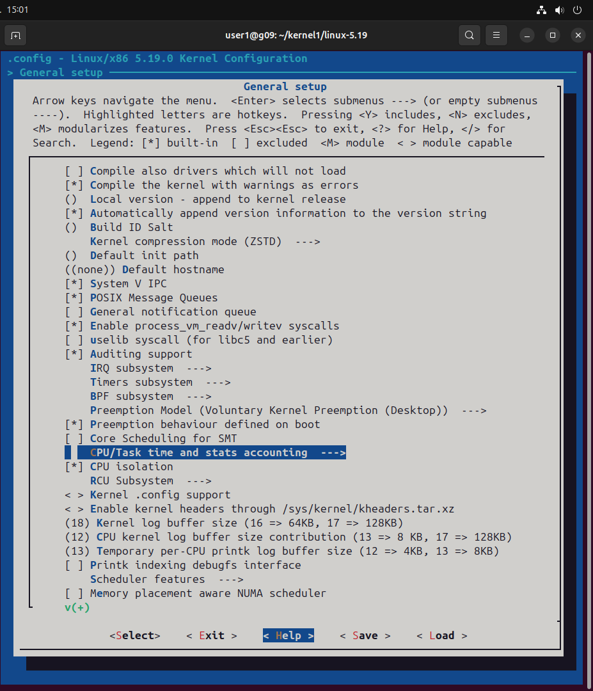
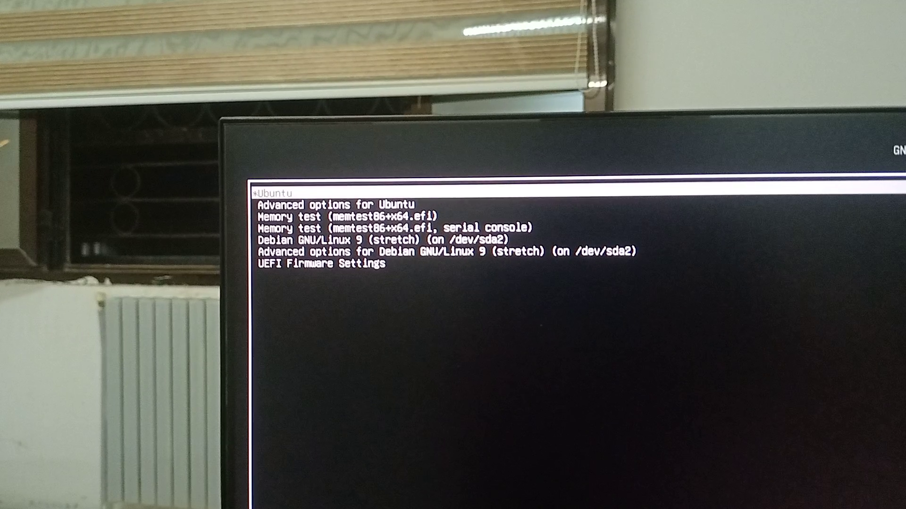

# Nouveau serveur Ubuntu

## Connexion SSH
```bash
ssh user@172.16.6.13
```


Le mot de passe est `user`.

## Obtenir le code source :
```bash
git clone --depth=1 --branch v6.8 https://git.kernel.org/pub/scm/linux/kernel/git/torvalds/linux.git
```

## Installer les paquets requis :
```bash
sudo apt-get install build-essential libncurses-dev bison flex libssl-dev libelf-dev
```

## Configurer le noyau :
### Outils de configuration :
```bash
make menuconfig  # Menu basé sur texte
```

Voici la documentation reformattée en français :

## Étape 4 : Compiler le noyau

```bash
make -j$(nproc)
```

## Installer les modules :

```bash
sudo make modules_install
```

## Installer le noyau :

```bash
sudo make install
```

## Étape 5 : Mettre à jour le chargeur de démarrage

### Mettre à jour GRUB :

```bash
sudo update-grub
```

## Étape 6 : Tester le noyau

### Redémarrer le système :

Redémarrez votre machine et sélectionnez le nouveau noyau dans le menu de démarrage.

[VID20241118001810.mp4](VID20241118001810.mp4)

## Étape 7 : Configurer un cadre de test

### Installer les outils de test :

Installez `kselftest` et `LTP` :

```bash
sudo apt-get install linux-tools-common linux-tools-$(uname -r)
sudo apt-get install ltp
```

### Exécuter les tests automatiques du noyau :

```bash
make kselftest
```

Vérifiez les résultats dans `output.log` ou le fichier journal spécifié.

### Exécuter le Linux Test Project (LTP) :

Naviguez vers le répertoire LTP et exécutez :

```bash
cd /path/to/ltp
./runltp
```


