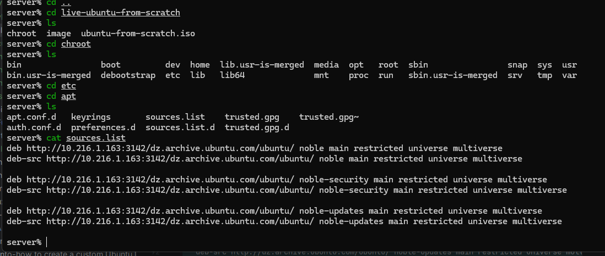
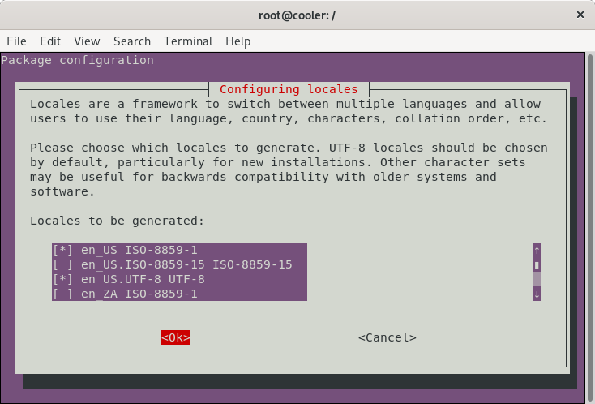
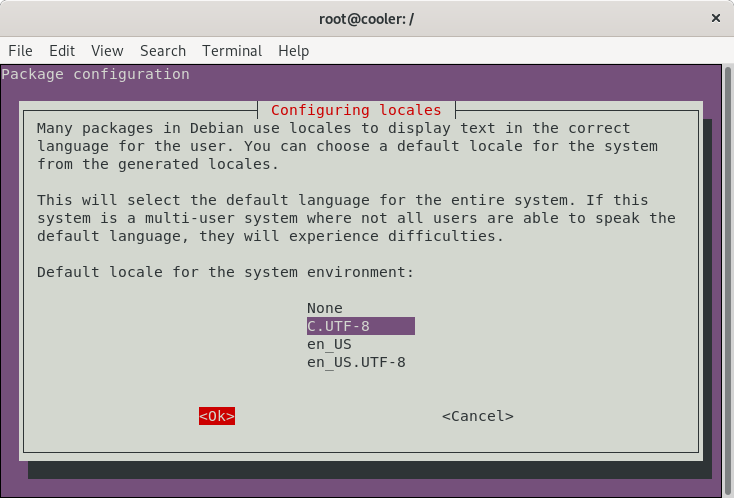
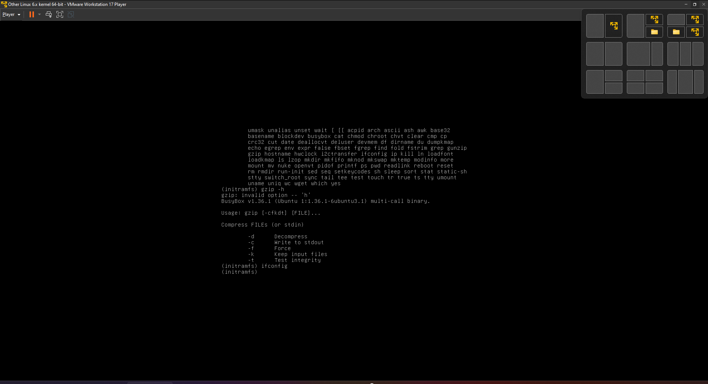

# How to create a custom AlgerianDistro live from scratch
  
 
 
## 1 Install packages we need in the `build system` required by our scripts.

```shell
sudo apt-get install \
   debootstrap \
   squashfs-tools \
   xorriso
```

```shell
mkdir $HOME/minimal-linux-live
```


## Étape 3 : Bootstrap le système de base

### Pour l'architecture x86

```bash
sudo debootstrap --arch amd64 focal ./rootfs http://192.168.8.149:3142/dz.archive.ubuntu.com/ubuntu/
```

### Pour l'architecture ARM

```bash
sudo debootstrap --arch armhf focal ./rootfs http://192.168.8.149:3142/dz.archive.ubuntu.com/ubuntu/
```


## Bootstrap and Configure AlgerianDistro

`debootstrap` is a program for generating OS images.  We install it into our `build system` to begin generating our ISO.

* Checkout bootstrap

  ```shell
  sudo debootstrap \
     --arch=amd64 \
     --variant=minbase \
     noble \
     $HOME/minimal-linux-live/chroot \
     http://192.168.8.149:3142/dz.archive.ubuntu.com/ubuntu/
  ```

  > **debootstrap** is used to create a Debian base system from scratch, without requiring the availability of **dpkg** or **apt**. It does this by downloading .deb files from a mirror site, and carefully unpacking them into a directory which can eventually be **chrooted** into.

* Configure external mount points

  ```shell
  sudo mount --bind /dev $HOME/minimal-linux-live/chroot/dev
  
  sudo mount --bind /run $HOME/minimal-linux-live/chroot/run
  ```

  As we will be updating and installing packages (grub among them), these mount points are necessary inside the chroot environment, so we are able to finish the installation without errors.

## Define chroot environment

*A chroot on Unix operating systems is an operation that changes the apparent root directory for the current running process and its children. A program that is run in such a modified environment cannot name (and therefore normally cannot access) files outside the designated directory tree. The term "chroot" may refer to the chroot system call or the chroot wrapper program. The modified environment is called a chroot jail.*

> Reference: <https://en.wikipedia.org/wiki/Chroot>

From this point we will be configuring the `live system`.

1. **Access chroot environment**

   ```shell
   sudo chroot $HOME/minimal-linux-live/chroot
   ```

2. **Configure mount points, home and locale**

   ```shell
   mount none -t proc /proc

   mount none -t sysfs /sys

   mount none -t devpts /dev/pts

   export HOME=/root

   export LC_ALL=C
   ```

   These mount points are necessary inside the chroot environment, so we are able to finish the installation without errors.

3. **Set a custom hostname**

   ```shell
   echo "algerian-distro-fs-live" > /etc/hostname
   ```

4. **Configure apt sources.list**

   ```shell
   cat <<EOF > /etc/apt/sources.list
   deb http://dz.archive.ubuntu.com/ubuntu/ noble main restricted universe multiverse
   deb-src http://dz.archive.ubuntu.com/ubuntu/ noble main restricted universe multiverse

   deb http://dz.archive.ubuntu.com/ubuntu/ noble-security main restricted universe multiverse
   deb-src http://dz.archive.ubuntu.com/ubuntu/ noble-security main restricted universe multiverse

   deb http://dz.archive.ubuntu.com/ubuntu/ noble-updates main restricted universe multiverse
   deb-src http://dz.archive.ubuntu.com/ubuntu/ noble-updates main restricted universe multiverse
   EOF
   ```

5. **Update indexes packages**

   ```shell
   apt-get update
   ```

6. **Install systemd**

   ```shell
   apt-get install -y libterm-readline-gnu-perl systemd-sysv
   ```

   > **systemd** is a system and service manager for Linux. It provides aggressive parallelization capabilities, uses socket and D-Bus activation for starting services, offers on-demand starting of daemons, keeps track of processes using Linux control groups, maintains mount and automount points and implements an elaborate transactional dependency-based service control logic.

7. **Configure machine-id and divert**

   ```shell
   dbus-uuidgen > /etc/machine-id

   ln -fs /etc/machine-id /var/lib/dbus/machine-id
   ```

   > The `/etc/machine-id` file contains the unique machine ID of the local system that is set during installation or boot. The machine ID is a single newline-terminated, hexadecimal, 32-character, lowercase ID. When decoded from hexadecimal, this corresponds to a 16-byte/128-bit value. This ID may not be all zeros.

   ```shell
   dpkg-divert --local --rename --add /sbin/initctl

   ln -s /bin/true /sbin/initctl
   ```

   > **dpkg-divert** is the utility used to set up and update the list of diversions.

8. **Upgrade packages**

   ```shell
   apt-get -y upgrade
   ```

9. **Install packages needed for Live System**

   ```shell
   apt-get install -y \
      sudo \
      ubuntu-standard \
      casper \
      discover \
      laptop-detect \
      os-prober \
      network-manager \
      net-tools \
      wireless-tools \
      wpagui \
      locales \
      grub-common \
      grub-gfxpayload-lists \
      grub-pc \
      grub-pc-bin \
      grub2-common \
      grub-efi-amd64-signed \
      shim-signed \
      mtools \
      binutils
   ```

   ```shell
   apt-get install -y --no-install-recommends linux-generic
   ```  

 
12. **Install some useful applications**
   **Install Visual Studio Code (optional)**

    1. Download and install the key

       ```shell
       curl https://packages.microsoft.com/keys/microsoft.asc | gpg --dearmor > microsoft.gpg

       install -o root -g root -m 644 microsoft.gpg /etc/apt/trusted.gpg.d/

       echo "deb [arch=amd64] https://packages.microsoft.com/repos/vscode stable main" > /etc/apt/sources.list.d/vscode.list

       rm microsoft.gpg
       ```

    2. Then update the package cache and install the package using

       ```shell
       apt-get update

       apt-get install -y code
       ```

14. **Install Google Chrome **

    1. Download and install the key

       ```shell
       wget -q -O - https://dl-ssl.google.com/linux/linux_signing_key.pub | sudo apt-key add -

       echo "deb http://dl.google.com/linux/chrome/deb/ stable main" > /etc/apt/sources.list.d/google-chrome.list
       ```

    2. Then update the package cache and install the package using

       ```shell
       apt-get update

       apt-get install google-chrome-stable
       ```

15. **Install Java JDK 8**

    ```shell
    apt-get install -y \
        openjdk-8-jdk \
        openjdk-8-jre
    ```

```shell
   apt-get install -y python3
```

```shell
apt-get install -y \
       clamav-daemon \
       terminator \
       apt-transport-https \
       curl \
       vim \
       nano \
       less
```

16. **Remove unused applications (optional)**

    ```shell
    apt-get purge -y \
       transmission-gtk \
       transmission-common \
       gnome-mahjongg \
       gnome-mines \
       gnome-sudoku \
       aisleriot \
       hitori
    ```

17. **Remove unused packages**

    ```shell
    apt-get autoremove -y
    ```

18. **Reconfigure packages**

    1. Generate locales

       ```shell
       dpkg-reconfigure locales
       ```

        1. *Select locales*
           <p align="center">
           
           </p>

        2. *Select default locale*
           <p align="center">
           
           </p>

    2. Configure network-manager

        1. Create config file

           ```shell
           cat <<EOF > /etc/NetworkManager/NetworkManager.conf
           [main]
           rc-manager=none
           plugins=ifupdown,keyfile
           dns=systemd-resolved
 
           [ifupdown]
           managed=false
           EOF
           ```

        2. Reconfigure network-manager

           ```shell
           dpkg-reconfigure network-manager
           ```

## Create the image directory and populate it

We are now back in our `build environment` after setting up our `live system` and will continue creating files necessary to generate the ISO.

1. Create directories

   ```shell
   mkdir -p /image/{casper,isolinux,install}
   ```

2. Copy kernel images

   ```shell
   cp /boot/vmlinuz-**-**-generic /image/casper/vmlinuz

   cp /boot/initrd.img-**-**-generic /image/casper/initrd
   ```

3. Copy memtest86+ binary (BIOS and UEFI)

   ```shell
    wget --progress=dot https://memtest.org/download/v7.00/mt86plus_7.00.binaries.zip -O /image/install/memtest86.zip
    unzip -p /image/install/memtest86.zip memtest64.bin > /image/install/memtest86+.bin
    unzip -p /image/install/memtest86.zip memtest64.efi > /image/install/memtest86+.efi
    rm -f /image/install/memtest86.zip
   ```

### GRUB menu configuration

1. Create base point access file for grub

   ```shell
   touch /image/ubuntu
   ```

2. Create image/isolinux/grub.cfg

   ```shell
   cat <<EOF > /image/isolinux/grub.cfg

   search --set=root --file /ubuntu

   insmod all_video

   set default="0"
   set timeout=30

   menuentry "Try AlgerianDistro FS without installing" {
      linux /casper/vmlinuz boot=casper nopersistent toram quiet splash ---
      initrd /casper/initrd
   }

   menuentry "Install AlgerianDistro FS" {
      linux /casper/vmlinuz boot=casper only-ubiquity quiet splash ---
      initrd /casper/initrd
   }

   menuentry "Check disc for defects" {
      linux /casper/vmlinuz boot=casper integrity-check quiet splash ---
      initrd /casper/initrd
   }

   grub_platform
   if [ "\$grub_platform" = "efi" ]; then
   menuentry 'UEFI Firmware Settings' {
      fwsetup
   }

   menuentry "Test memory Memtest86+ (UEFI)" {
      linux /install/memtest86+.efi
   }
   else
   menuentry "Test memory Memtest86+ (BIOS)" {
      linux16 /install/memtest86+.bin
   }
   fi
   EOF
   ```
 
### Creating image

 
2. Copy EFI loaders

   ```shell
   cp /usr/lib/shim/shimx64.efi.signed.previous isolinux/bootx64.efi
   cp /usr/lib/shim/mmx64.efi isolinux/mmx64.efi
   cp /usr/lib/grub/x86_64-efi-signed/grubx64.efi.signed isolinux/grubx64.efi
   ```

3. Create a FAT16 UEFI boot disk image containing the EFI bootloaders

   ```shell
   (
      cd isolinux && \
      dd if=/dev/zero of=efiboot.img bs=1M count=10 && \
      mkfs.vfat -F 16 efiboot.img && \
      LC_CTYPE=C mmd -i efiboot.img efi efi/ubuntu efi/boot && \
      LC_CTYPE=C mcopy -i efiboot.img ./bootx64.efi ::efi/boot/bootx64.efi && \
      LC_CTYPE=C mcopy -i efiboot.img ./mmx64.efi ::efi/boot/mmx64.efi && \
      LC_CTYPE=C mcopy -i efiboot.img ./grubx64.efi ::efi/boot/grubx64.efi && \
      LC_CTYPE=C mcopy -i efiboot.img ./grub.cfg ::efi/ubuntu/grub.cfg
   )
   ```

4. Create a grub BIOS image

   ```shell
   grub-mkstandalone \
      --format=i386-pc \
      --output=isolinux/core.img \
      --install-modules="linux16 linux normal iso9660 biosdisk memdisk search tar ls" \
      --modules="linux16 linux normal iso9660 biosdisk search" \
      --locales="" \
      --fonts="" \
      "boot/grub/grub.cfg=isolinux/grub.cfg"
   ```

5. Combine a bootable Grub cdboot.img

   ```shell
   cat /usr/lib/grub/i386-pc/cdboot.img isolinux/core.img > isolinux/bios.img
   ```

6. Generate md5sum.txt

   ```shell
   /bin/bash -c "(find . -type f -print0 | xargs -0 md5sum | grep -v -e 'isolinux' > md5sum.txt)"
   ```

### Cleanup the chroot environment

1. If you installed software, be sure to run

   ```shell
   truncate -s 0 /etc/machine-id
   ```

2. Remove the diversion

   ```shell
   rm /sbin/initctl

   dpkg-divert --rename --remove /sbin/initctl
   ```

3. Clean up

   ```shell
   apt-get clean

   rm -rf /tmp/* ~/.bash_history

   umount /proc

   umount /sys

   umount /dev/pts

   export HISTSIZE=0

   exit
   ```

## Unbind mount points

```shell
sudo umount $HOME/minimal-linux-live/chroot/dev

sudo umount $HOME/minimal-linux-live/chroot/run
```

## Compress the chroot

After everything has been installed and preconfigured in the **chrooted** environment, we need to generate an image of everything that was done by following the next steps in the `build environment`.

1. Access build directory

   ```shell
   cd $HOME/minimal-linux-live
   ```

2. Move image artifacts

   ```shell
   sudo mv chroot/image .
   ```

3. Create squashfs

   ```shell
   sudo mksquashfs chroot image/casper/filesystem.squashfs \
      -noappend -no-duplicates -no-recovery \
      -wildcards \
      -comp xz -b 1M -Xdict-size 100% \
      -e "var/cache/apt/archives/*" \
      -e "root/*" \
      -e "root/.*" \
      -e "tmp/*" \
      -e "tmp/.*" \
      -e "swapfile"
   ```

   > **Squashfs** is a highly compressed read-only filesystem for Linux. It uses zlib compression to compress both files, inodes and directories. Inodes in the system are very small and all blocks are packed to minimize data overhead. Block sizes greater than 4K are supported up to a maximum of 64K.
   > **Squashfs** is intended for general read-only filesystem use, for archival use (i.e. in cases where a .tar.gz file may be used), and in constrained block device/memory systems (e.g. **embedded systems**) where low overhead is needed.

4. Write the filesystem.size

   ```shell
   printf $(sudo du -sx --block-size=1 chroot | cut -f1) | sudo tee image/casper/filesystem.size
   ```

## Create ISO Image for a LiveCD (BIOS + UEFI + Secure Boot)

1. Access build directory

   ```shell
   cd $HOME/minimal-linux-live/image
   ```

2. Create iso from the image directory using the command-line

   ```shell
   sudo xorriso \
      -as mkisofs \
      -iso-level 3 \
      -full-iso9660-filenames \
      -J -J -joliet-long \
      -volid "AlgerianDistro from scratch" \
      -output "../minimal-linux-live.iso" \
      -eltorito-boot isolinux/bios.img \
        -no-emul-boot \
        -boot-load-size 4 \
        -boot-info-table \
        --eltorito-catalog boot.catalog \
        --grub2-boot-info \
        --grub2-mbr ../chroot/usr/lib/grub/i386-pc/boot_hybrid.img \
        -partition_offset 16 \
        --mbr-force-bootable \
      -eltorito-alt-boot \
        -no-emul-boot \
        -e isolinux/efiboot.img \
        -append_partition 2 28732ac11ff8d211ba4b00a0c93ec93b isolinux/efiboot.img \
        -appended_part_as_gpt \
        -iso_mbr_part_type a2a0d0ebe5b9334487c068b6b72699c7 \
        -m "isolinux/efiboot.img" \
        -m "isolinux/bios.img" \
        -e '--interval:appended_partition_2:::' \
      -exclude isolinux \
      -graft-points \
         "/EFI/boot/bootx64.efi=isolinux/bootx64.efi" \
         "/EFI/boot/mmx64.efi=isolinux/mmx64.efi" \
         "/EFI/boot/grubx64.efi=isolinux/grubx64.efi" \
         "/EFI/ubuntu/grub.cfg=isolinux/grub.cfg" \
         "/isolinux/bios.img=isolinux/bios.img" \
         "/isolinux/efiboot.img=isolinux/efiboot.img" \
         "."
   ```

## Alternative way, if previous one fails, create an Hybrid ISO

1. Create a ISOLINUX (syslinux) boot menu

   ```shell
   cat <<EOF> isolinux/isolinux.cfg
   UI vesamenu.c32

   MENU TITLE Boot Menu
   DEFAULT linux
   TIMEOUT 600
   MENU RESOLUTION 640 480
   MENU COLOR border       30;44   #40ffffff #a0000000 std
   MENU COLOR title        1;36;44 #9033ccff #a0000000 std
   MENU COLOR sel          7;37;40 #e0ffffff #20ffffff all
   MENU COLOR unsel        37;44   #50ffffff #a0000000 std
   MENU COLOR help         37;40   #c0ffffff #a0000000 std
   MENU COLOR timeout_msg  37;40   #80ffffff #00000000 std
   MENU COLOR timeout      1;37;40 #c0ffffff #00000000 std
   MENU COLOR msg07        37;40   #90ffffff #a0000000 std
   MENU COLOR tabmsg       31;40   #30ffffff #00000000 std

   LABEL linux
    MENU LABEL Try AlgerianDistro FS
    MENU DEFAULT
    KERNEL /casper/vmlinuz
    APPEND initrd=/casper/initrd boot=casper

   LABEL linux
    MENU LABEL Try AlgerianDistro FS (nomodeset)
    MENU DEFAULT
    KERNEL /casper/vmlinuz
    APPEND initrd=/casper/initrd boot=casper nomodeset
   EOF
   ```

2. Include syslinux bios modules

   ```shell
   apt install -y syslinux-common && \
   cp /usr/lib/ISOLINUX/isolinux.bin image/isolinux/ && \
   cp /usr/lib/syslinux/modules/bios/* image/isolinux/
   ```

3. Access build directory

   ```shell
   cd $HOME/minimal-linux-live/image
   ```

4. Create iso from the image directory

   ```shell
   sudo xorriso \
      -as mkisofs \
      -iso-level 3 \
      -full-iso9660-filenames \
      -J -J -joliet-long \
      -volid "AlgerianDistro from scratch" \
      -output "../minimal-linux-live.iso" \
    -isohybrid-mbr /usr/lib/ISOLINUX/isohdpfx.bin \
    -eltorito-boot \
        isolinux/isolinux.bin \
        -no-emul-boot \
        -boot-load-size 4 \
        -boot-info-table \
        --eltorito-catalog isolinux/isolinux.cat \
    -eltorito-alt-boot \
        -e /EFI/boot/efiboot.img \
        -no-emul-boot \
        -isohybrid-gpt-basdat \
    -append_partition 2 0xef EFI/boot/efiboot.img \
      "$HOME/minimal-linux-live/image"
   ```

## Make a bootable USB image

It is simple and easy, using "dd"


```shell
sudo dd if=minimal-linux-live.iso of=<device> status=progress oflag=sync
```


